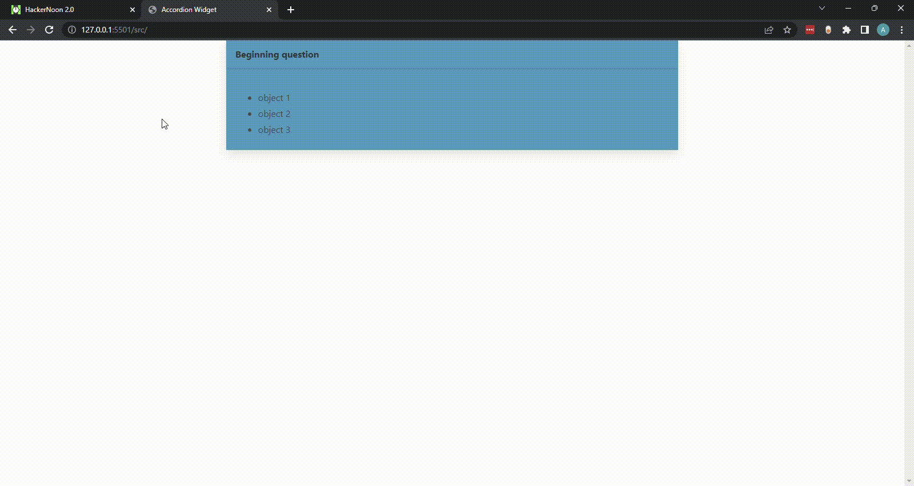

# AccordionWidget

This widget is designed to give a question/answer or call/response feel to asking questions in a DAG type of questionnaire set.

# Demo


# How to use it
There are a few items that will need to be specified in order to make this component/widget workable as outlined below.

## Html structure
The javascript component looks for a few templates to insert the children onto the webpage with easily customizable html. 

### Templates
There are two templates that will be needed to work, the answer template (for the terminus) and the question-answer template. 
1. **Terminus html**
    * Must have a `root` class on the first html tag of the template
    * Must have an `answer` class on the html tag that will contain the information

    Here is an example of the template used in the source content
    ```
    <template id="answer-template">
        <div class="root is-active">
            <div class="card-content">
                <span class="answer"></span>
            </div>
        </div>
    </template>
    ```
1. **Question-Answer html**
    * Must have a `root` class on the first html tag of the template
    * Must have a `question` class on the html tag that will have its textContent equivalent to the text attribute.
    * Must have a `repeated-items` class on the html tag that will contain each answer. This node will for each child answer attribute and appended to the parent of the `repeated-items` node.
    
    Here is an example as used in the source code
    ```
    <template id="answer-template">
        <div class="root is-active">
            <div class="card-content">
                <span class="answer"></span>
            </div>
        </div>
    </template>
    ```
### Html for content
Where you would like the accordion to be appended must be an empty tag with an id corresponding to the id passed to the constructor for the AccordionWidget. The nodes from the template will be appropriately appended to this root tag based on whether they are a terminus or a question-answer.

For example, the root id identifying where the accordion will be is used is `root-id`

Constructor:
```
const contentProm = await fetch('./example.json');
const content = await contentProm.json()
const accordionWidget = new AccordionWidget(content, 'root-id');
```
Html:
```
<div class="content">
    <div class="card" id="root-id"> // all children will be appended to this node 
    </div> 
</div>
```

### Json structure
The json object to be used can be loaded from a file or a variable but must be passed into the constructor for the class as below. The structure of the json does have a recursive order to it (with an exception of the first node). There is also a self-referential structure for **terminus** nodes that will be touched on after these basics.

The schema is as-follows:
```
{
    "text": "blah blah",
    "answer": "answer", // NOTE: This attribute would not be used at the top-level and is only NOT used at the top-level.
    "children": [
        {
            "text": "blah blah",
            "answer": "blah",
            "children": [...]
        },
        {
            ...
        }
    ]
}
```

A more complete example is below.
```
{
    "text": "lorem ipsum", 
    // NOTE: No answer here, the only place it is not required
    "children": [
        {
            "answer": "clickable item by user",
            "text": "Question for the next set",
            "children": [
                {
                    "answer": "no more items",
                    "text": "you're done!"
                    // NOTE: The absence of children implies that there is no question
                }
            ]
        },
        {
            "answer": "other option presented to user with the question 'lorem ipsum'",
            "text": "all done",
            // NOTE: No other options since this is a terminus point.
        }
    ]
}
```
For an example that is used in the demo above, [see here](/src/example.json)

### Self-referential Json
This is a more complicated feature where answers should link back to other question sets. It should be noted that using this will add all the prerequisite questions and answers to the accordion.

In order to use this feature, modify the json structure to take advantage of the referential object and follow these two rules:
1. The `referentialAnswer` attribute must line up with an `answer` verbatim elsewhere in the json structure or the link will not take the user to the right place in the tree and a corresponding error will be logged to the developer console.
1. The `referentialAnswer` attribute must be a substring of the text attribute in the same object or the text will not render and a corresponding error will be logged to the developer console.
```
{
    "text": "blah",
    "children": [
        {
            "answer": "self referential",
            "referential": {
                "text": "Go to Choice 2",
                "referentialAnswer": "Choice 2" 
            }
        },
        {
            "answer": "Choice 2",
            "text": "You did a self-referential item"
        }
    ]
}
```